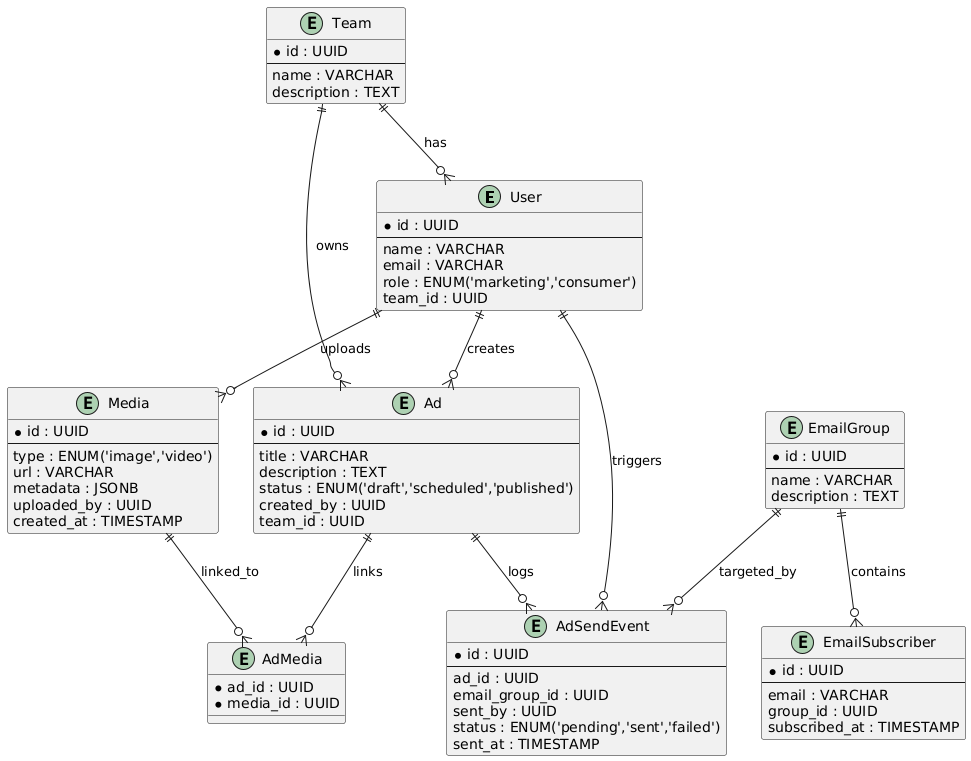
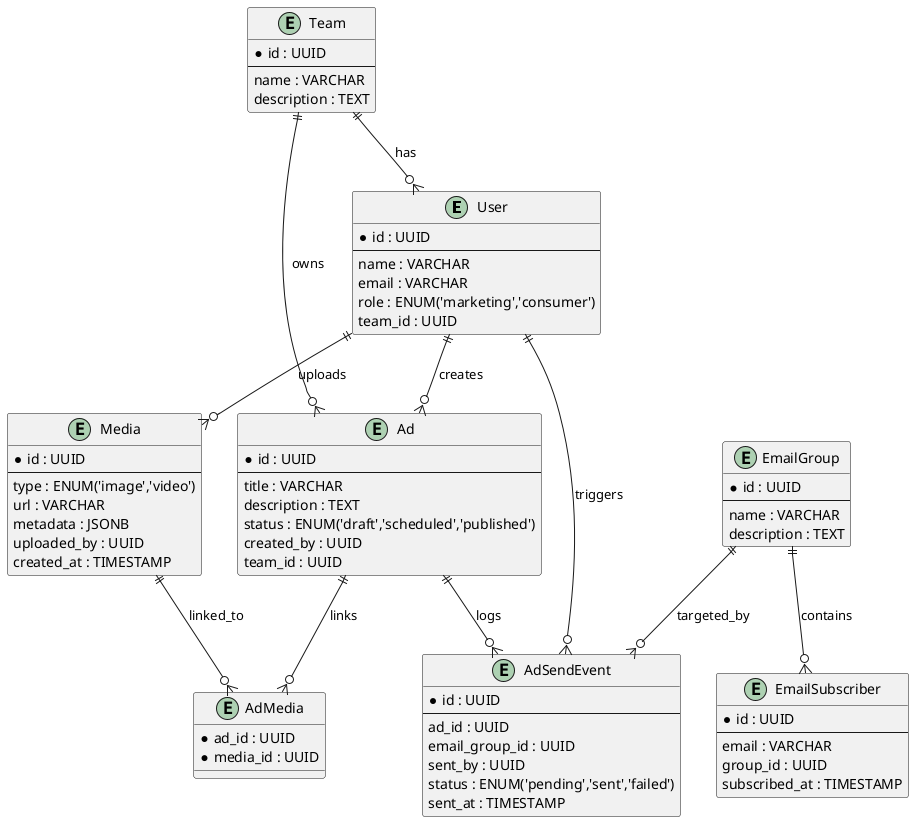

## 🔧 Functional Requirements (Detailed)

### 1. **CRUD for Media Content**

#### Images & Videos

* Upload (store securely, validate format/size)
* View/List (with pagination, filters)
* Update (replace metadata or file)
* Delete (soft delete preferred)

### 2. **CRUD for Ads**

* Create Ad (title, description, media associations, call-to-action, tags)
* Read/List Ads (filter by campaign, status, media type, etc.)
* Update Ad content and media
* Delete Ad (soft delete for audit)

### 3. **CRUD for Subscribed Emails**

* Add email (with validation & duplication checks)
* View/List emails
* Group emails (custom named segments)
* Remove email / Delete groups

### 4. **Send Ads to Emails**

* Select Ads & Target Email Groups
* Compose custom message or template
* Send now or schedule
* Email sending via transactional email service (e.g., SendGrid, SES)
* Delivery tracking, open/click analytics

### 5. **User and Role Management**

#### Roles: `marketing`, `consumer`

* Marketing:

  * Full access to ad and media management
  * Manage email groups
  * Send ads via email
* Consumer:

  * View-only access to published ads/content

### 6. **Marketing Teams**

* Teams contain users with marketing roles
* CRUD Teams (name, description, members)
* Team-level access to content

---

## 🚀 \[Future] Google Ads Publishing

* Integration with Google Ads API

  * OAuth2 for account authorization
  * Create/update campaigns
  * Publish/unpublish ads
* Permission checks (only team admins or approved users)
* Audit log for external publishing actions

---

## 🧩 Data Models (Simplified)

```plaintext
User { id, name, email, role, team_id }
Team { id, name, description }
Media { id, type: image|video, url, metadata, uploaded_by, created_at }
Ad { id, title, description, media_ids[], status, created_by, team_id }
EmailSubscriber { id, email, group_id, subscribed_at }
EmailGroup { id, name, description }
AdSendEvent { id, ad_id, email_group_id, sent_by, status, sent_at }
```

---
### 📊 Data Models (PlantUML)

#### SQL UML Diagram (PostgreSQL)





####

---

## 🌐 Core APIs (Sketch)

### Media

* `POST /media` (Upload)
* `GET /media?type=image` (List)
* `DELETE /media/{id}`

### Ads

* `POST /ads`
* `GET /ads`
* `PUT /ads/{id}`
* `DELETE /ads/{id}`

### Emails

* `POST /emails`
* `GET /emails`
* `POST /email-groups`
* `GET /email-groups`
* `POST /ads/{id}/send` (Send ad to email group)

### Teams & Users

* `POST /teams`
* `GET /teams`
* `POST /users` (with role & team)

---

## 🔁 Workflows

### A. Upload Ad & Send to Email

1. Marketing user uploads image/video
2. Creates an Ad associating media
3. Selects email group
4. Sends Ad → Email group receives content

### B. Team Collaboration

1. Admin creates a team
2. Adds marketing users
3. Team shares media/ad access

### C. \[Future] Publish to Google Ads

1. OAuth2 connect Google Ads account
2. Select ad → publish/unpublish via API

---

## 📈 Non-Functional Requirements

### High Consistency

* Use a strong consistency database (e.g., PostgreSQL)
* Eventual consistency okay for analytics, but not for ad content

### High Idempotency

* API endpoints must support idempotency keys (especially `POST /ads/{id}/send`)
* Avoid duplicate sends or uploads

### Availability & Low Latency

* Use CDN for media
* Async background jobs for email sending
* Caching for static lists

---

## 🧪 Audit & Security Considerations

* Audit logs: Ad creations, email sends, user changes
* Rate limits and abuse prevention
* Role-based access control (RBAC)
* Email opt-in/opt-out compliance
