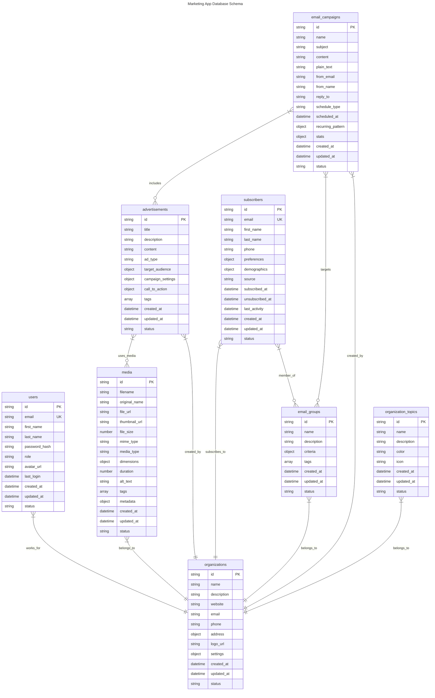

```mermaid
---
title: Marketing App Database Schema
---
erDiagram
    organizations {
        string id PK
        string name
        string description
        string website
        string email
        string phone
        object address
        string logo_url
        object settings
        datetime created_at
        datetime updated_at
        string status
    }

    users {
        string id PK
        string email UK
        string first_name
        string last_name
        string password_hash
        string role
        string avatar_url
        datetime last_login
        datetime created_at
        datetime updated_at
        string status
    }

    media {
        string id PK
        string filename
        string original_name
        string file_url
        string thumbnail_url
        number file_size
        string mime_type
        string media_type
        object dimensions
        number duration
        string alt_text
        array tags
        object metadata
        datetime created_at
        datetime updated_at
        string status
    }

    advertisements {
        string id PK
        string title
        string description
        string content
        string ad_type
        object target_audience
        object campaign_settings
        object call_to_action
        array tags
        datetime created_at
        datetime updated_at
        string status
    }

    subscribers {
        string id PK
        string email UK
        string first_name
        string last_name
        string phone
        object preferences
        object demographics
        string source
        datetime subscribed_at
        datetime unsubscribed_at
        datetime last_activity
        datetime created_at
        datetime updated_at
        string status
    }

    email_groups {
        string id PK
        string name
        string description
        object criteria
        array tags
        datetime created_at
        datetime updated_at
        string status
    }

    email_campaigns {
        string id PK
        string name
        string subject
        string content
        string plain_text
        string from_email
        string from_name
        string reply_to
        string schedule_type
        datetime scheduled_at
        object recurring_pattern
        object stats
        datetime created_at
        datetime updated_at
        string status
    }

    organization_topics {
        string id PK
        string name
        string description
        string color
        string icon
        datetime created_at
        datetime updated_at
        string status
    }

    %% Relationships
    users }|--|| organizations : works_for
    media }|--|| organizations : belongs_to
    advertisements }|--|| organizations : created_by
    subscribers }|--|| organizations : subscribes_to
    email_groups }|--|| organizations : belongs_to
    email_campaigns }|--|| organizations : created_by
    organization_topics }|--|| organizations : belongs_to

    advertisements }|--o{ media : uses_media
    subscribers }|--o{ email_groups : member_of
    email_campaigns }|--o{ email_groups : targets
    email_campaigns }|--o{ advertisements : includes
```
