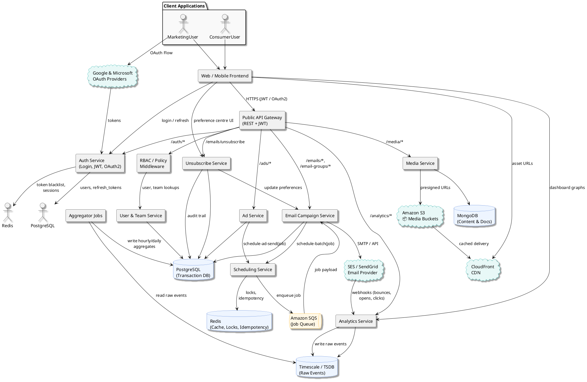

# Component Design

## PlantUML Code

```plantuml
@startuml MarketingApp_System

' -----------------------------------------------------------
' 1. Appearance / Legend
' -----------------------------------------------------------
skinparam componentStyle rectangle
skinparam shadowing true
skinparam package {
  BorderColor black
  BackgroundColor #F9F9F9
}
skinparam database {
  BackgroundColor #EEF5FF
  BorderColor #3366CC
}
skinparam queue {
  BackgroundColor #FFF7E6
  BorderColor #FFAA00
}
skinparam cloud {
  BackgroundColor #E8F8F7
  BorderColor #00AAA0
}
hide stereotype

' -----------------------------------------------------------
' 2. Predeclare components that would conflict
' -----------------------------------------------------------
queue "Amazon SQS\n(Job Queue)" as QUEUE_SQS
database "Redis\n(Cache, Locks, Idempotency)" as REDIS_DB

' -----------------------------------------------------------
' 3. Actors & Entrypoints
' -----------------------------------------------------------
package "Client Applications" {
  actor MarketingUser as MU
  actor ConsumerUser as CU
}

component "Web / Mobile Frontend" as FE
component "Public API Gateway\n(REST + JWT)" as APIG

MU --> FE
CU --> FE
FE --> APIG : HTTPS (JWT / OAuth2)

' -----------------------------------------------------------
' 4. Cross-cutting Platform Services
' -----------------------------------------------------------
component "Auth Service\n(Login, JWT, OAuth2)" as AUTH
component "User & Team Service" as USER_SVC
component "RBAC / Policy\nMiddleware" as RBAC

APIG --> AUTH : /auth/*
APIG --> RBAC
RBAC --> USER_SVC : user, team lookups

AUTH --> "PostgreSQL" : users, refresh_tokens
AUTH --> Redis : token blacklist,\nsessions

' -----------------------------------------------------------
' 5. Domain Microservices
' -----------------------------------------------------------
component "Media Service" as MEDIA_SVC
component "Ad Service" as AD_SVC
component "Email Campaign Service" as EMAIL_SVC
component "Scheduling Service" as SCHED_SVC
component "Analytics Service" as ANALYTICS_SVC
component "Unsubscribe Service" as UNSUB_SVC

APIG --> MEDIA_SVC      : /media/*
APIG --> AD_SVC         : /ads/*
APIG --> EMAIL_SVC      : /emails/*,\n/email-groups/*
APIG --> UNSUB_SVC      : /emails/unsubscribe
APIG --> ANALYTICS_SVC  : /analytics/*

AD_SVC    --> SCHED_SVC : schedule-ad-send(job)
EMAIL_SVC --> SCHED_SVC : schedule-batch(job)

SCHED_SVC --> QUEUE_SQS : enqueue job
EMAIL_SVC <-- QUEUE_SQS : job payload

' -----------------------------------------------------------
' 6. Data Stores
' -----------------------------------------------------------
database "PostgreSQL\n(Transaction DB)"    as PG
database "MongoDB\n(Content & Docs)"       as MDB
database "Timescale / TSDB\n(Raw Events)"  as TSDB

USER_SVC     --> PG
AD_SVC       --> PG
EMAIL_SVC    --> PG
UNSUB_SVC    --> PG
MEDIA_SVC    --> MDB
ANALYTICS_SVC --> TSDB
SCHED_SVC    --> REDIS_DB : locks,\nidempotency

' -----------------------------------------------------------
' 7. Object Storage / CDN
' -----------------------------------------------------------
cloud "Amazon S3\n📦 Media Buckets" as S3
cloud "CloudFront\nCDN"            as CF

MEDIA_SVC --> S3 : presigned URLs
S3         --> CF : cached delivery
FE         --> CF : asset URLs

' -----------------------------------------------------------
' 8. Messaging & Email Delivery
' -----------------------------------------------------------
cloud "SES / SendGrid\nEmail Provider" as ESP

EMAIL_SVC --> ESP : SMTP / API
ESP        --> ANALYTICS_SVC : webhooks (bounces,\nopens, clicks)

' -----------------------------------------------------------
' 9. External Identity & Integrations
' -----------------------------------------------------------
cloud "Google & Microsoft\nOAuth Providers" as OAUTH

MU    --> OAUTH : OAuth Flow
OAUTH --> AUTH  : tokens

' -----------------------------------------------------------
' 10. Compliance / Preference Centre
' -----------------------------------------------------------
UNSUB_SVC --> EMAIL_SVC : update preferences
UNSUB_SVC --> PG        : audit trail

FE --> AUTH           : login / refresh
FE --> UNSUB_SVC      : preference centre UI
FE --> ANALYTICS_SVC  : dashboard graphs

' -----------------------------------------------------------
' 11. Analytics Aggregation Pipeline
' -----------------------------------------------------------
component "Aggregator Jobs" as AGG

ANALYTICS_SVC --> TSDB : write raw events
AGG            --> TSDB : read raw events
AGG            --> PG   : write hourly/daily\naggregates

@enduml
```

## Diagram

