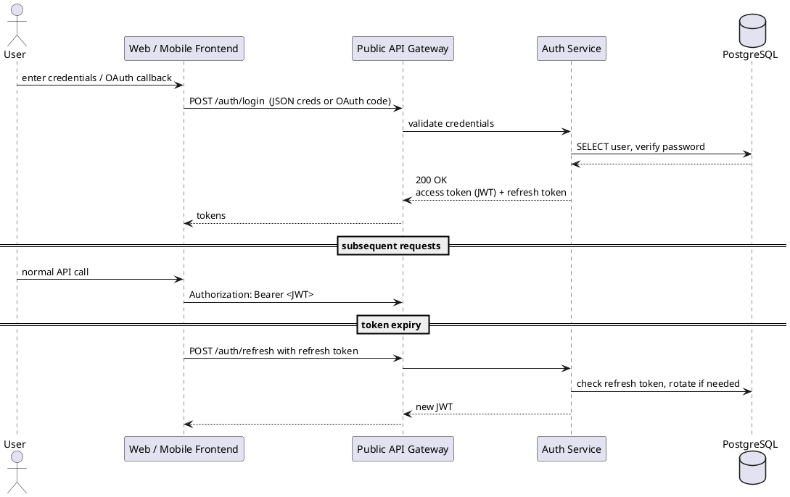

# Sequence Diagrams for Key Flows

## 1. User Authentication (login → JWT → refresh)




---

## 2. Media Upload (via pre-signed S3 URL)

```plantuml
@startuml Media_Upload
actor MarketingUser as MU
participant FE
participant APIG
participant MEDIA_SVC
cloud S3
cloud CF as "CloudFront CDN"

MU   -> FE           : select image/video
FE   -> APIG         : POST /media (metadata)
APIG -> MEDIA_SVC    : request pre-signed URL
MEDIA_SVC -> S3      : Generate URL (PUT, TTL=15 min)
S3 --> MEDIA_SVC
MEDIA_SVC --> APIG   : 201 Created + pre-signed URL
APIG --> FE
FE  -> S3            : direct PUT upload
S3 --> FE            : 200 OK
FE  -> APIG          : POST /media/{id}/complete
APIG -> MEDIA_SVC
MEDIA_SVC -> CF      : (optional) Invalidate path
MEDIA_SVC --> APIG   : 200 OK
APIG --> FE          : upload confirmed
@enduml
```
---

## 3. Schedule & Send Email Campaign

```plantuml
@startuml Email_Campaign
actor MarketingUser as MU
participant FE
participant APIG
participant EMAIL_SVC
participant SCHED_SVC
queue QUEUE_SQS
participant EmailWorker as "EMAIL_SVC\nworker"
cloud ESP as "SES / SendGrid"
participant ANALYTICS_SVC

MU  -> FE              : Schedule campaign (UI form)
FE  -> APIG            : POST /emails  {template, group, time}
APIG -> EMAIL_SVC      : create draft
EMAIL_SVC --> APIG     : 201 Created (campaign_id)

== scheduling ==
APIG -> SCHED_SVC      : POST /schedule (campaign_id, datetime)
SCHED_SVC --> APIG     : 202 Accepted

every 60 s
SCHED_SVC -> QUEUE_SQS : push due job (campaign_id)

== worker ==
EmailWorker <-- QUEUE_SQS : pull job
EmailWorker -> EMAIL_SVC   : fetch campaign + recipients
EmailWorker -> ESP         : send batch
ESP --> EmailWorker        : delivery/response
EmailWorker -> ANALYTICS_SVC: emit send events (bounces, opens)
@enduml
```

---

## 4. Subscriber Unsubscribe (global & group-level)

```plantuml
@startuml Unsubscribe_Flow
actor Subscriber
participant EmailClient as "Mail Client"
participant FE          as "Preference Centre"
participant APIG
participant UNSUB_SVC
participant PG
participant EMAIL_SVC
cloud ESP

== user clicks link ==
Subscriber -> EmailClient : click JWT unsubscribe URL
EmailClient -> FE         : open /emails/unsubscribe?token=...
FE -> APIG                : GET /preferences (JWT)
APIG -> UNSUB_SVC         : validate JWT, look up subscriber
UNSUB_SVC -> PG           : SELECT subscription
PG --> UNSUB_SVC
UNSUB_SVC --> APIG        : 200 + current status
APIG --> FE               : render preference page

== user confirms ==
Subscriber -> FE          : press “Unsubscribe”
FE -> APIG                : POST /emails/unsubscribe { global=true }
APIG -> UNSUB_SVC
UNSUB_SVC -> PG           : UPDATE subscribers SET global_opt_out=true
UNSUB_SVC -> EMAIL_SVC    : publish preference-updated event
UNSUB_SVC --> APIG        : 204 No Content
APIG --> FE               : show success

== confirmation email ==
UNSUB_SVC -> ESP          : Send confirmation
ESP --> UNSUB_SVC         : 202 Accepted
@enduml
```