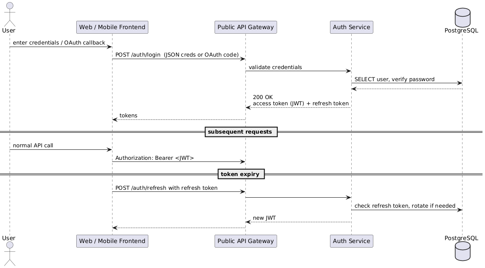
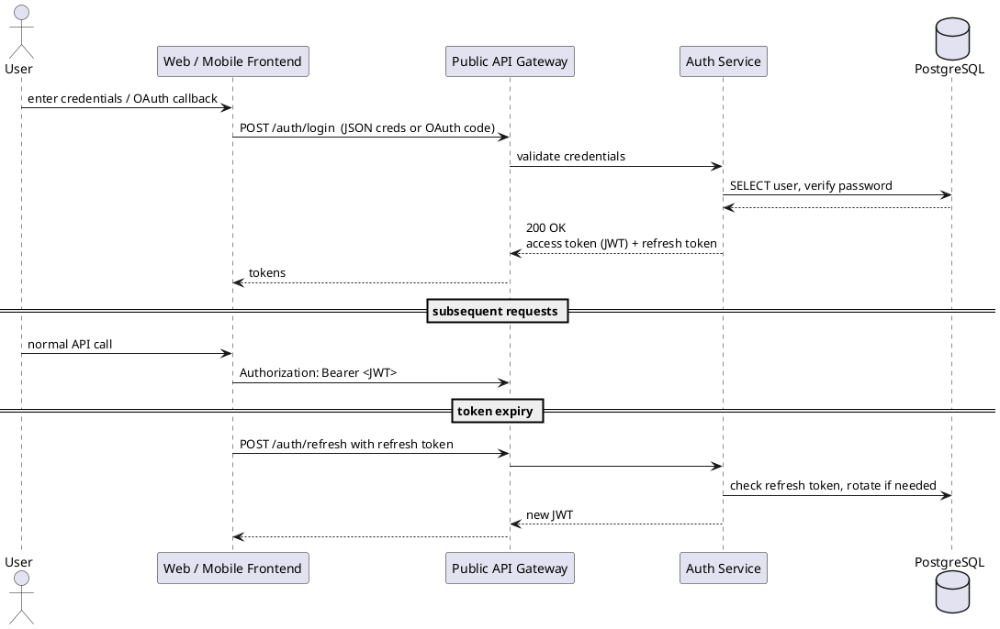
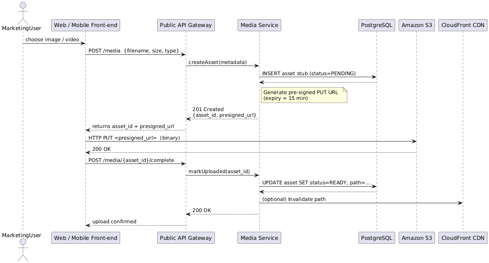
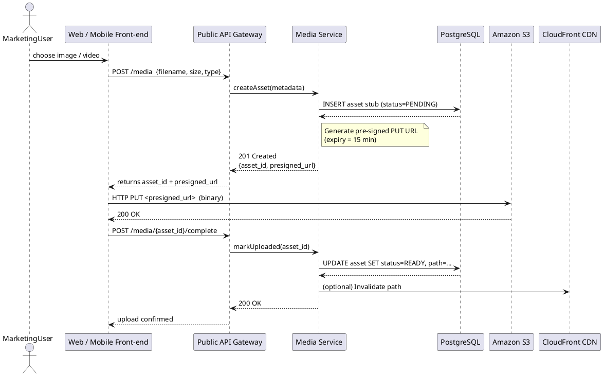
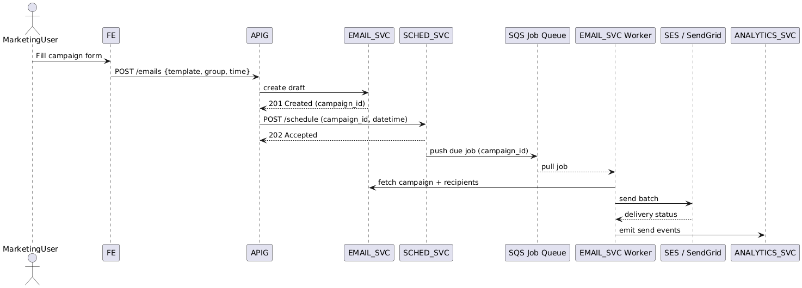
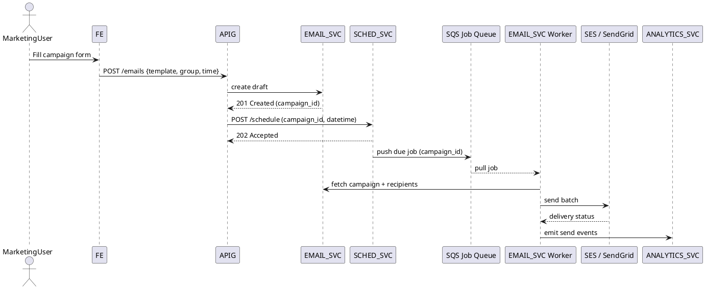
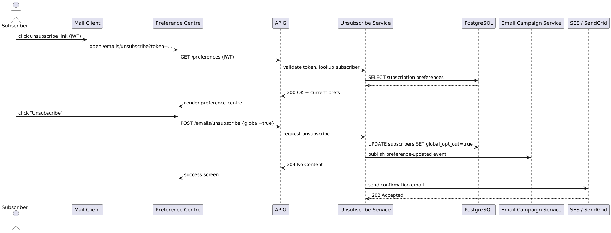
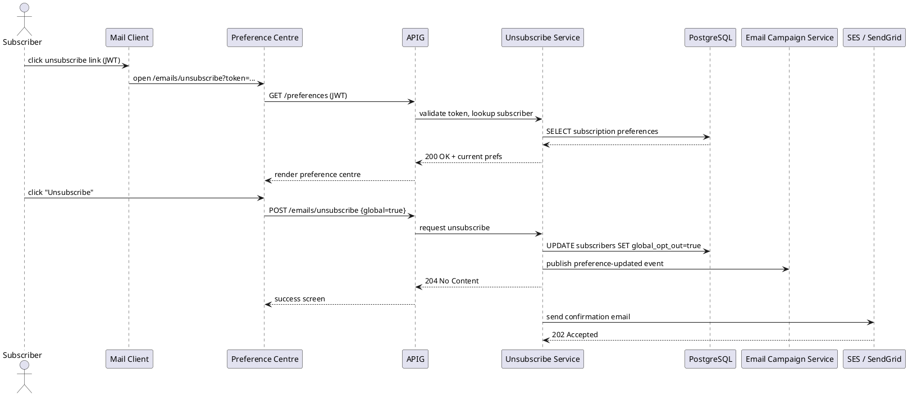

# Sequence Diagrams for Key Flows

## 1. User Authentication (login → JWT → refresh)

---

## 2. Media Upload (via pre-signed S3 URL)

---

## 3. Schedule & Send Email Campaign

---

## 4. Subscriber Unsubscribe (global & group-level)

