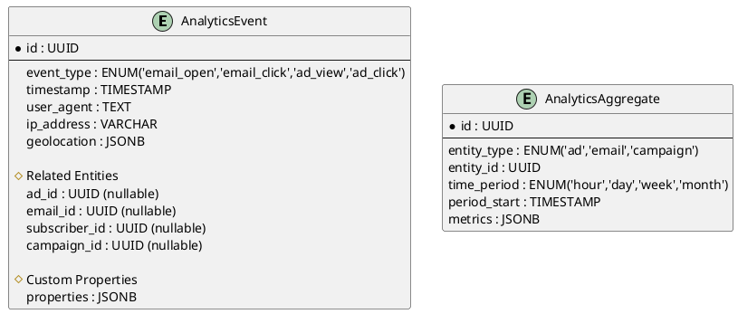

# 📊 Analytics

## Analytics Data Model

## Storage Strategy

- Time-series database for raw events
- Periodic aggregation to pre-computed summaries
- Hot storage (30 days) → Warm storage (90 days) → Cold storage (archival)

## Event Collection

- Email opens
- Ad interactions
- Deliveries and bounces (not delivered)
- UTM (Urchin Tracking Module) parameter tracking for attribution

## Analytics API Endpoints

- `GET /analytics/ads/{id}` (Ad performance metrics)
- `GET /analytics/campaigns/{id}` (Campaign performance)
- `GET /analytics/email-groups/{id}/performance` (Group engagement)
- `GET /analytics/dashboard` (Aggregate metrics for dashboards)

## Data Retention

- Raw events: 90 days
- Hourly aggregates: 12 months
- Daily aggregates: 36 months
- Monthly aggregates: indefinite
