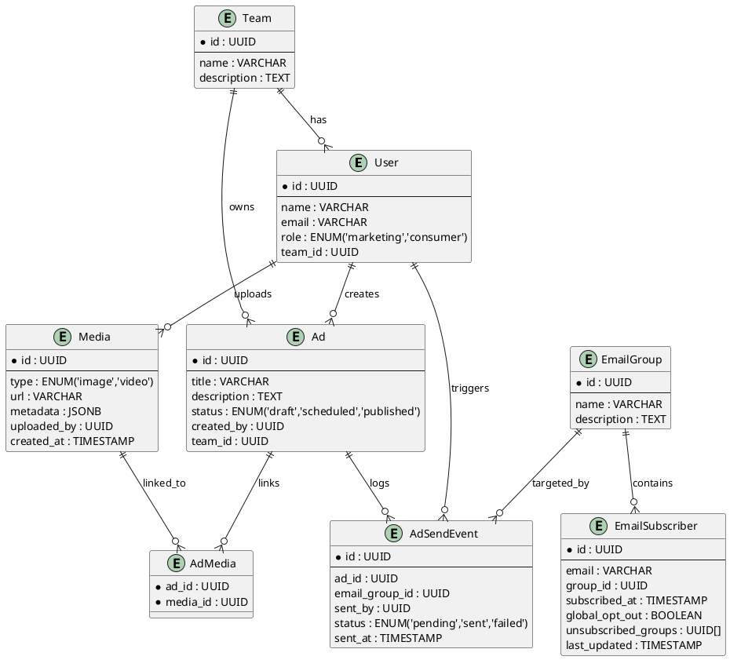
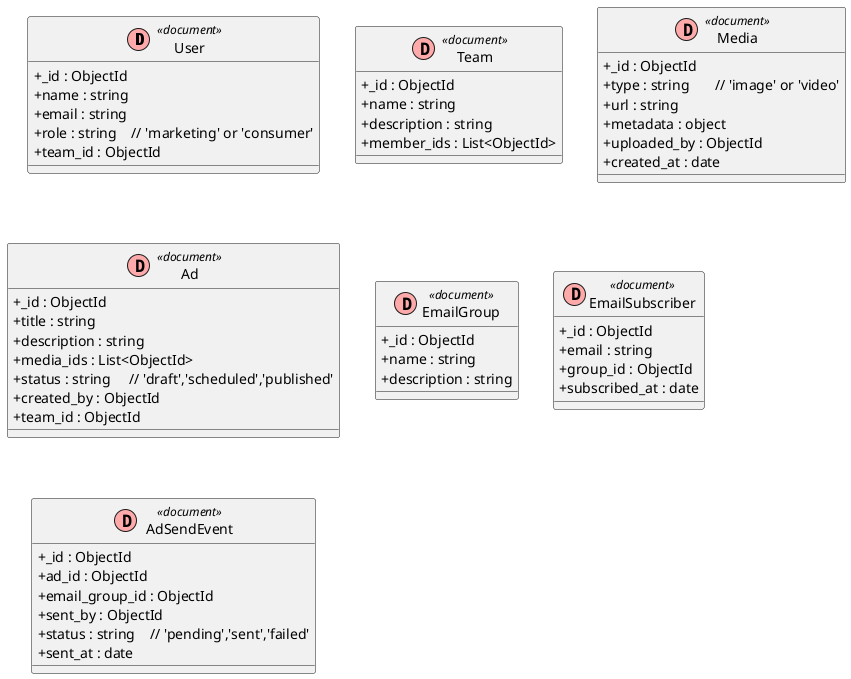

# 🧩 Data Models

## Simplified Data Models

```plaintext
User { id, name, email, role, team_id }
Team { id, name, description }
Media { id, type: image|video, url, metadata, uploaded_by, created_at }
Ad { id, title, description, media_ids[], status, created_by, team_id }
EmailSubscriber { id, email, group_id, subscribed_at }
EmailGroup { id, name, description }
AdSendEvent { id, ad_id, email_group_id, sent_by, status, sent_at }
```

## SQL UML Diagram (PostgreSQL)




## NoSQL Document Schemas (MongoDB)



